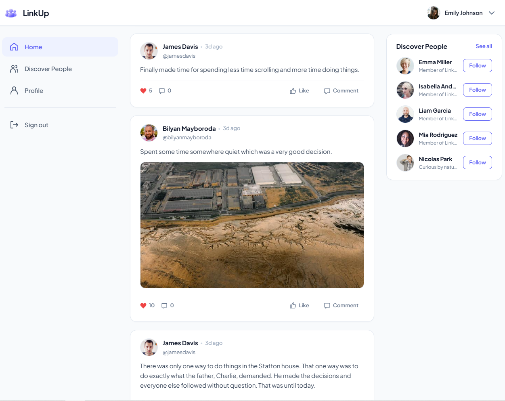
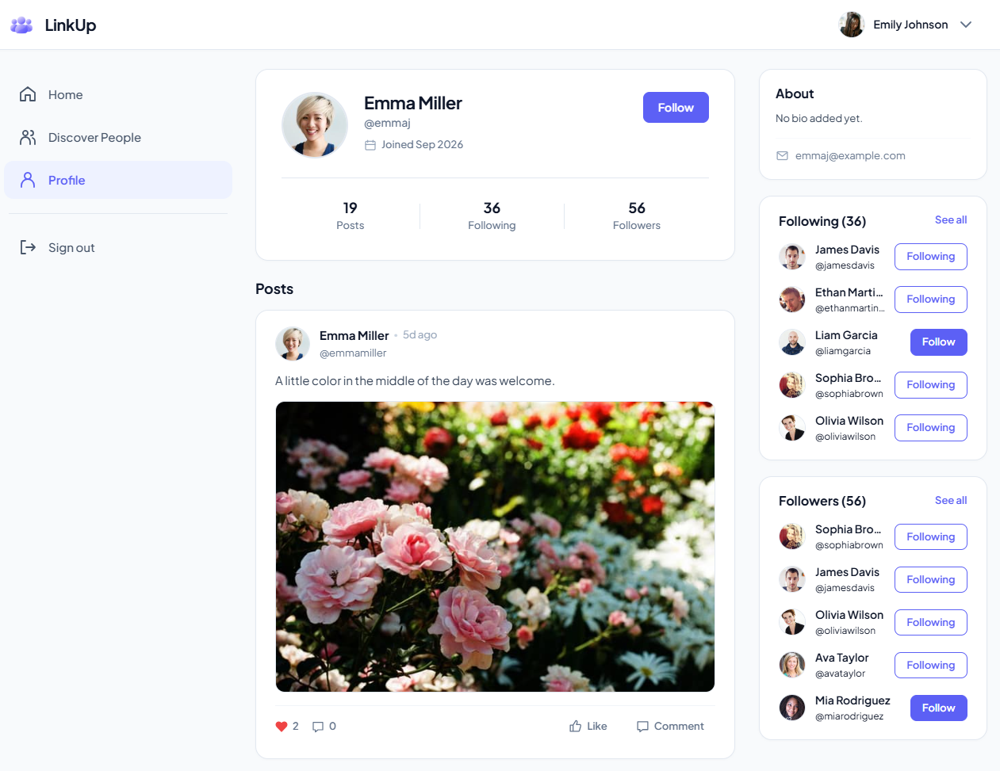
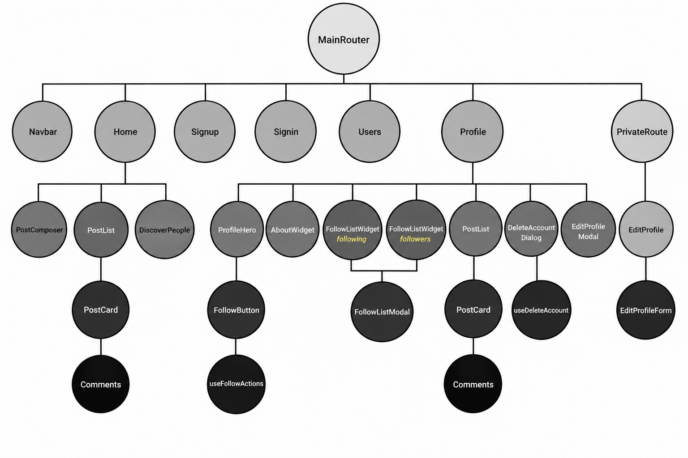

# LinkUp: Social Media App

A MERN stack social media application built with **React**, **Express**, and **MongoDB**. Users can create posts, follow other users, interact with posts, and add comments, while visitors can explore public content before signing in.

The Express backend follows a **layered structure** with **routes**, **controllers**, and **Mongoose models**, separating API endpoints, application logic, and database operations. The client uses reusable React components and API helpers to keep interface and request logic organized.

Authentication is handled with **JWT**, and protected actions require a logged-in user. User edits and deletion are ownership-checked, and post deletion verifies the original poster. Mongoose `populate()` is used to load related user details for posts and comments.





## Component Architecture



## Running it locally

**Install dependencies**

Use Node.js 24 for the client build and test tooling.

```bash
npm ci --prefix client
npm ci --prefix server
```

**Start the server**

```bash
cp server/.env.example server/.env
```

Generate a JWT secret and set `JWT_SECRET` in `server/.env` to the output:

```bash
node -e "console.log(require('node:crypto').randomBytes(48).toString('hex'))"
```

Set `LINKUP_DB_URI` to your MongoDB Atlas connection string and `LINKUP_NS` to the database containing your users and posts.

Start the server:

```bash
npm run server:dev
```

**Start the client**

In a second terminal:

```bash
npm run client
```

Open **http://localhost:3000** in your browser. The API runs on **port 5000**.

## License

Package metadata declares this project as **MIT licensed**. A standalone `LICENSE` file is not currently included.
