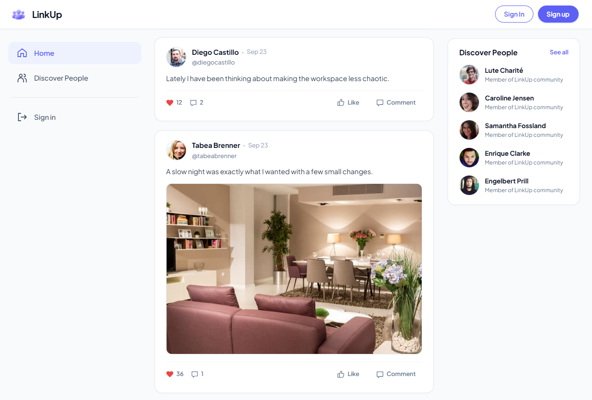
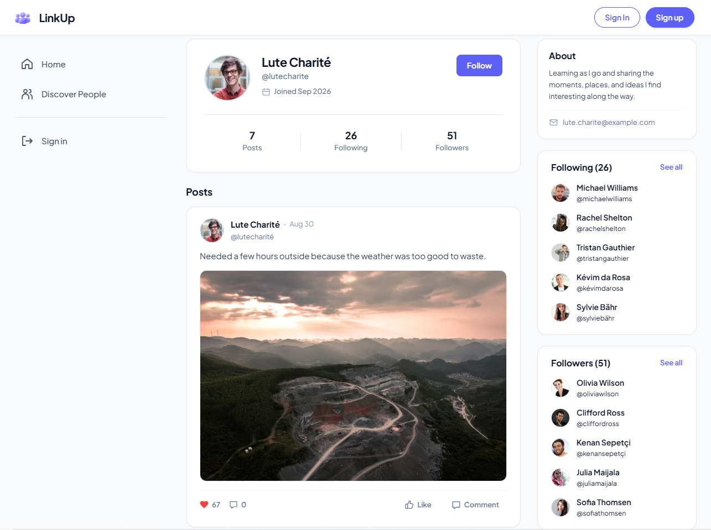

# LinkUp: Social Media App

LinkUp is a social platform for sharing thoughts, stories, questions, and progress with friends, colleagues, and people you discover along the way. Publish a post, follow someone whose perspective interests you, or join a conversation through likes and comments.

You can explore the community before creating an account. When you are ready to contribute, sign up and make LinkUp your own.

## A feed shaped by the people you follow

Your feed brings together your own posts and updates from people you follow. Share something you have learned, ask a question, or let others know what you are working on. Add a photo when an image helps tell the story.

As you scroll through your feed, more posts load automatically so you can keep reading without clicking through pages.

## Discover people and build connections

Discover People introduces you to members you might want to get to know. Open any suggestion to visit their profile, read their posts, and decide whether to follow them.

The Community Members page gives you a broader view of the community. Select a member to visit their profile, or keep scrolling to explore more people.

Following someone adds their posts to your feed. You can unfollow them from their profile whenever your interests change.

## Turn posts into conversations

Like a post to show appreciation, or open its comments to read what others have to say. Add your own reply to ask a question, offer a perspective, or continue the discussion.

You can remove your own comments and delete your own posts when you need to. Visitors can browse public posts and read comments; signing in lets them participate.

## A profile that tells your story

Your profile brings your posts, photo, bio, and connections together in one place. Update your name, add a short introduction, and choose a profile photo to help people recognize you.

Following and Followers cards show a small preview of your connections. Open either list to browse more people and visit their profiles. You can also open these lists from the counts in the profile header.

## License

This project is licensed under the [MIT](LICENSE) License.
